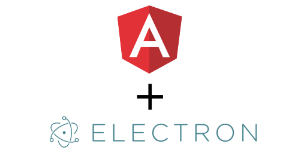

[](https://travis-ci.org/AhmedMKamal/angular-electron)
[](https://david-dm.org/AhmedMKamal/angular-electron)
[](https://coveralls.io/github/AhmedMKamal/angular-electron?branch=master)
[](https://snyk.io/test/github/AhmedMKamal/angular-electron)

# Angular Electron

**Don't think too much about configuration, just focus on code.**

# Before You Begin

If you are new to the angular world, electron world or both it's recommended to take a look at the documentation first.

 * Angular - [Official Website](https://angular.io/).
 * Electron - [Official Website](https://electronjs.org/).

# Prerequisites

Install `@angular/cli` globally.

```
$ yarn add global @angular/cli
# or
$ npm i -g @angular/cli
```

Install `electron` globally.

```
$ yarn add global electron
# or
$ npm i -g electron
```

# How to Use?

Get clone from the repo.

```
$ git clone https://github.com/AhmedMKamal/angular-electron.git
```

Redirect to the repo folder.

```
$ cd angular-electron
```

Install the dependencies.

```
$ yarn install
# or
$ npm install
```

Build the app.

```
$ yarn build
# or
$ npm run build
```

And see it in action.

```
$ yarn start
# or
$ npm start
```

# Running the tests

Simply run.

```
$ yarn test
# or
$ npm run test
```

And e2e.

```
$ yarn e2e
# or
$ npm run e2e
```

> The build and test processes have lint hook by default and will fail if the linting process failed.

# Deployment

I don't want to stuck with specific packing tool, so it's up to you to choose one of the most used tools listed below.

 * [electron-forge](https://github.com/electron-userland/electron-forge)
 * [electron-builder](https://github.com/electron-userland/electron-builder)
 * [electron-packager](https://github.com/electron-userland/electron-packager)

# Credits

Thanks [ThorstenHans](https://github.com/ThorstenHans) for the package [ngx-electron](https://github.com/ThorstenHans/ngx-electron) :heart:

# License

[The MIT License](https://github.com/AhmedMKamal/angular-electron/LICENSE.md)